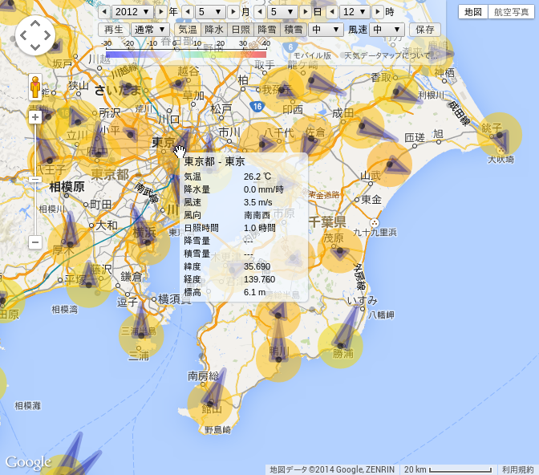

# [天気データマップ](http://higuma.boo.jp/tenki-data-map/)

天気データマップは気象庁にある日本の過去の天気情報をGoogleマップ上に表示するWebアプリケーションです。次のURLで公開しています。HTML5対応ブラウザで動作します(詳しくは本ドキュメント後半の「対応ブラウザ」をご覧下さい)。

<http://higuma.boo.jp/tenki-data-map/>

> 過去天気の履歴を表示するアプリケーションです(本日の天気は表示できません)。最新情報はサイト管理者(作者本人)の最終データ更新作業日の前日になります。なるべく毎日更新していますが、都合により数日間更新されない場合もありますのでご了承下さい。

## アプリケーションの説明

ブラウザで天気データマップのURLにアクセスするとGoogleマップの日本地図が現れ、マップ上に気象庁の観測点(気象台とアメダス)に天気データ(気温、降水量、日照時間、降雪量、積雪量から選択可)のグラデーションと風速・風向の分布を表示します。

")

日時や表示の設定はウィンドウ上部のコントロールパネルで行います。

* 一段目は時刻設定で、年月日時を一時間単位で指定できます
* 二段目は各種表示設定です
    * アニメーション: `再生`を押すと一時間単位で時刻が連続して変化します
    * アニメーション速度: `遅い`、`通常`、`速い`、`最速`から選択します
    * グラデーション表示: 次の5種類から選択します
        * `気温`: 気温(℃)
        * `降水`: 降水量(mm)
        * `日照`: 日照時間(時)
        * `降雪`: 降雪量(cm)
        * `積雪`: 積雪量(cm)
    * グラデーションサイズ設定: `大`、`中`、`小`、`なし`から選択します
    * 風向・風速表示設定: `大`、`中`、`小`、`なし`から選択します
    * `保存`ボタン: 現在の状態をURLのハッシュ(#)に設定してブラウザ履歴に保存します
* 三段目は次の通りです
    * グラデーションスケール(表示選択と連動して切り替わります)
    * PC版/モバイル版切り替え(URLリンク)
    * 本ドキュメントへのURLリンク

iPhoneとAndroid端末は起動時に判定を行い画面を小さめに調整したモバイル版を起動し、それ以外はPC版を起動します。PC版とモバイル版は画面サイズが異なるだけで機能に違いはなく自由に切り替えできます。

地図の移動、拡大・縮小などの操作方法は通常のGoogleマップと同じです。観測点にマウスをかざすとその地点の天気データをポップアップ表示します。

ポップアップ地点をクリックすると情報ビューを開きます。

")

情報ビューの構成は次の通りです。

* 最上部(コントロールパネルの直下)にマップ上の時刻とクリックした地点名を表示します
* 右上の`閉じる`ボタンをクリックすると情報ビューを閉じます
* 次の行は表示切り替えボタンです
    * `気温`: 気温トレンドグラフ
    * `降水`: 降水量トレンドグラフ
    * `風速`: 風速トレンドグラフ
    * `日照`: 日照時間トレンドグラフ
    * `降雪`: 降雪量トレンドグラフ
    * `積雪`: 積雪量トレンドグラフ
    * `データ`: 一日分のデータ表
    * `地点情報`: 地域、地名、緯度、経度、標高、観測量種別を表示
* その下の領域に各種トレンドグラフやデータ表、地点情報を表示します

> トレンドグラフの横(時間)軸は伸縮自在でズームインは12時間幅まで、ズームアウトはデータが存在する期間全体まで連続して行えます。操作方法は次の通りです。
> 
> * クリック: マップ時刻変更 + ズーム/ドラッグ開始 - マップの日時(赤の縦線)も連動して更新します
> * 横ドラッグ: 表示範囲移動(表示範囲が横にシフトします)
> * 縦ドラッグまたはホイール: ズーム(拡大・縮小)
> * Shift + クリック: マップ時刻は変更せずに表示範囲移動(横ドラッグだけ有効になります)
> * Control + クリック: マップ時刻は変更せずにズーム(縦ドラッグだけ有効になります)

気象庁ホームページにある最古の一時間データは1882年1月12日の青森の降水量です。そこから現在までを表示したのが次の画面です(最大ズームアウトの例)。

次のグラフは豪雪地として有名な青森県酢ケ湯の最近3年分の降雪量トレンドです。マーカ(赤線)は日本記録の566cmを記録した時刻です。

`データ`を選択するとマーカ時刻の一日分のデータの一覧を表示します。観測していないかまたは機器異常などによる欠測の部分は'---'と表示します。マップが表示している現在時刻はハイライト表示します。

`地点情報`を選択するとその地点の地名や位置情報などを表示します。天気データマップは気象庁ホームページが対象とする全地点に対応しており、南極(昭和基地)のデータも表示できます。

## 対応ブラウザ

HTML5のインラインSVGに対応したブラウザで動作します。次のブラウザで動作を確認しています。大量のデータを扱うアプリケーションのため一番高速に動作するChromeがおすすめです。

* Google Chrome (推奨: もっとも軽快に動作します)
* Mozilla Firefox (動作は少し遅くなりますが機能は問題ありません)
* Internet Explorer (IE9で確認: ただし後述の問題点があります)

> IE10以上は作者のWindows環境がVista(サポート外)のため未確認です。その他SafariやOperaなども未確認ですが主要ブラウザの現行バージョンはほぼ動作すると思います。作者の古いスマートフォン(Samsung Galaxy S2)でも動作しました(皆さんがお持ちの機種でも動作すると思います)。タブレットは持っていません(たぶん問題ないと思います)。

起動時にブラウザがインラインSVGに対応しているかどうかを検出し、非対応の場合は画面上部に「このブラウザでは動作しません」とメッセージを表示します。

> IE9で突然このメッセージが表示されて起動できなくなる現象を確認しています。この場合はブラウザが後方互換モードになっていますので互換モードボタンをクリックするか、または開発者ツールの「ブラウザモード」と「ドキュメントモード」を最新モードに設定して下さい。

IE9で次の問題を確認しています(最初の項目は重要ですからIE9ユーザの方はよくご確認下さい)。

* (特に処理能力の低いPCで)設定を`最速`または`速い`に設定してアニメーションの`再生`ボタンを押すと最終時刻に到達するまで制御不能になることがあります。もし発生した場合は次の2つの選択肢があります。
    * 最終時刻まで待ち続ければアニメーションが停止して制御可能になります。しかし数年以上前を実行中の場合は何時間(何日?)も先にならないと終了しません。
    * その場合はタスクマネージャで強制終了することができます。ただし多少のデータ損失は覚悟して下さい(例えばさっき入力したばかりのパスワードは再入力が必要になるでしょう)。
        * タスクマネージャを起動(Ctrl-Alt-Delなど)
        * Internet Explorerタスクを強制終了(方法が分からない方はWeb検索してみて下さい)
* マップを極端にズームインすると地図上の天候表示が消えてしまいますが、ズームアウトして元に戻すと復帰します。これは実用上問題ないと判断し特別な対策は行っていません。
* インストール直後数回起動後にマップ上でマウスドラッグ操作が効かなくなる現象を把握しています。これはブラウザのインストール直後に発生し、再起動や互換モード変更などを数回行うと現象は消滅しました。再現困難のためそれ以上の検証は行っていません。

> アニメーション駆動部はブラウザの種類に関係なく全て同じJavaScriptコードを用いていますがChromeやFirefoxは全く問題なく、(確認できた限りでは)IE9でのみ問題を生じます。現在IE9でもより安全に使用できるよう対応を検討しています。

## ソフトウエアについて

本アプリケーションはフリーソフトウエアです。作者によるソフトウエアコードはMITライセンスに準拠します(See [LICENCE.txt](LICENCE.txt))。

* [MIT Licence (参考和訳)](http://sourceforge.jp/projects/opensource/wiki/licenses%2FMIT_license)

本アプリケーションは[Google Maps API](https://developers.google.com/maps/)を利用しています。Googleのライセンス方針は次をご覧下さい。

* [Google Maps APIのライセンス](https://developers.google.com/maps/licensing?hl=ja)

ソフトウエアのソースコードとテストデータを本GitHubリポジトリで公開します。詳しくは次をご覧下さい。

* [開発者用ドキュメント(補足)](devdoc.md)

> サイトで公開している全データは次のURLから取得できます。
> 
> <http://higuma.boo.jp/tenki-data-map-files/data/>

## データについて

本アプリケーションのデータは気象庁ホームページの「過去の気象データ検索」から取得した1時間ごとの値です。

* [過去の気象データ検索](http://www.data.jma.go.jp/obd/stats/etrn/index.php "過去の気象データ検索")

データの著作権は気象庁の方針に従います。気象庁ホームページ掲載情報の著作権については次をご覧下さい。

* [著作権・リンク・個人情報保護について](http://www.jma.go.jp/jma/kishou/info/coment.html)

## 作者

宮根 裕司 (<myuj1964@gmail.com>)
